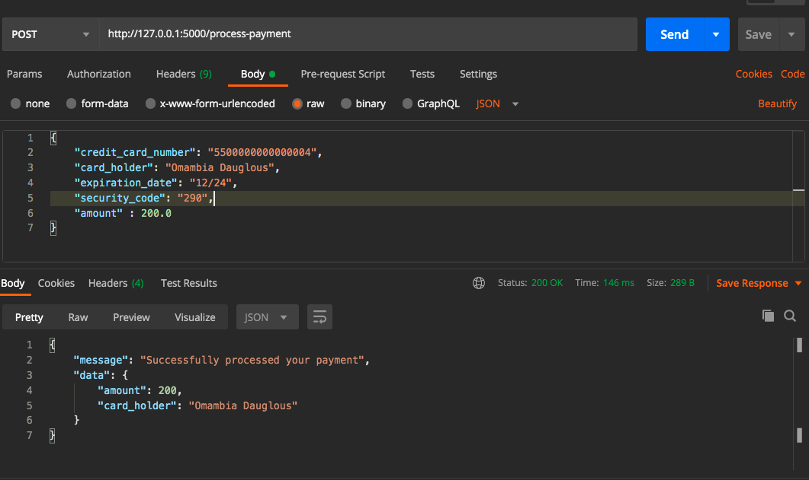
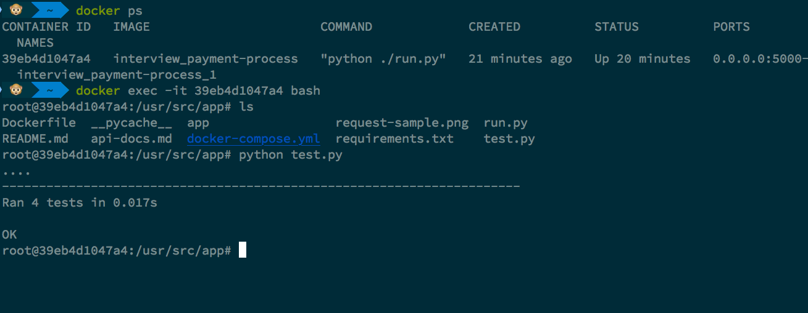

# Process Payment
- Flask dockerized payment service, aimed for displaying how to test a flask restfull application .
 
## How to Run the Application

### Option 1 -> Old School and the Easiest 

1. Navigate to your desired directory `e.g workspace` and create a directory of your choice `mdkir <test-flask>`
2. Assuming You have `python3.7` and above installed. Create a virtualenv as `$ python3 -m venv venv`
3. Activate your virtualenv  as `$ source venv/bin/activate`
4. To Run test `$ python test.py`
5. To Run  app `$ python run.py`

#### Testing Service



### Option 2 -> Dockerized Service
To run this application first head to this repo and clone  it to your local machine, and follow the following few steps to have it running.
```
	$ git clone https://github.com/domambia/interview-payment-process.git <some-name>
	cd <some-name>
```

#### Prerequisite Setup

The following are required for one to be able to run this application in development/prodiuction

1. [Docker](https://www.docker.com/get-started) -  Makes easy developement, deploying and running the application. Install it by following the the link.
2. [Docker Machine](https://docs.docker.com/compose/install/) 


#### Running Test
While your current directory is `<some-name>`
```
	$ docker-compose up --build 
```
The above command runs the application, please refer to [api-docs](https://github.com/domambia/interview-payment-process/blob/main/api-docs.md) to be understand how to test and understand different statuses and messages


Open another terminal
```
$ docker ps # from the list get the `CONTAINER ID` of e.g `39eb4d1047a4`  from the screenshot bellow.
$ docker exec -t -i CONTAINER_ID bash  or docker exec -t -i CONTAINER_ID sh

$ python test.py

$ # Huleee!! You just run test successfully!!!
```	
##### Running Test



 
 ## Meta

 - Omambia Dauglous
 - MIT license	